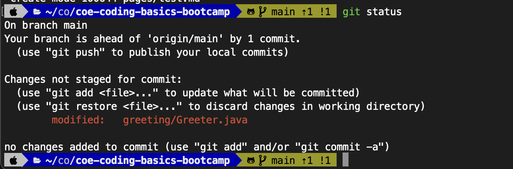
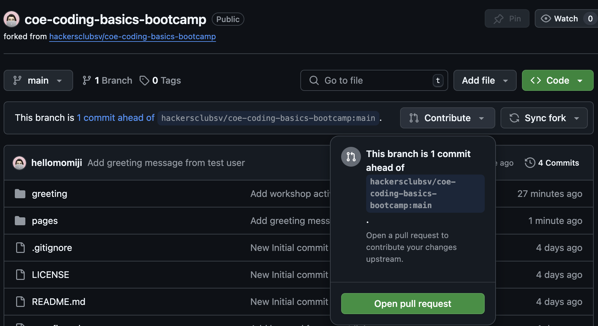
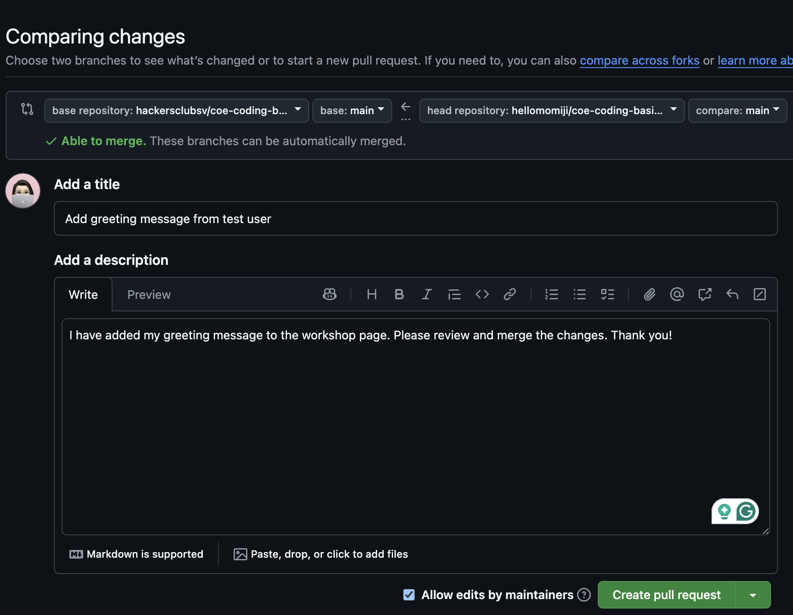

# Introduction
Welcome to our **beginner-friendly** coding bootcamp!

In this 1-hour hands-on workshop, you'll learn:
1. Java Syntax & OOP Basics
2. Essential Linux Commands (ls, cd, mkdir, touch, rm, etc.)
3. Git Version Control and GitHub Repository Management (clone, push, pull, commit, PR, etc.)

## Table of Contents
1. [Pre-Workshop Checklist](#pre-workshop-checklist)
2. [Activity 1: Java Basics](#activity-1-navigate-in-terminalshell-and-learn-java-basics)
3. [Activity 2: Git Practice](#activity-2-pratice-essential-commands-and-git-basics)

# Pre-Workshop Checklist

## 1. Required Installations

| Tool           | Verification Command              |
| -------------- | --------------------------------- |
| Java JDK 11+   | `java -version && javac -version` |
| Git            | `git --version`                   |
| Terminal/Shell | `ls` (should list files)          |

## 2. GitHub Account

1. Create free account: [github.com/signup](https://github.com/signup)
2. **Optional**: Set up SSH keys ([guide](https://docs.github.com/en/authentication/connecting-to-github-with-ssh))

If you have not installed the required tools, please refer to the [Setup Guide](https://hackersclubsv.github.io/coe-coding-basics-bootcamp/pages/contents/setup-guide).

# Workshop Activities
Please follow the instructions below to complete the workshop activities.

## Activity 1: Navigate in Terminal/Shell and Learn Java Basics

### 1-1. Open your Terminal/Shell
- Open your terminal or shell application on your local machine.
- Use the `pwd` command to print the current working directory path. 

```bash
pwd
```

- Navigate to the directory where you want to store the workshop files.
- Use the `cd` command to change directories.

```bash
cd <DIRECTORY_PATH>
```

- Create a new directory for the workshop files using the `mkdir` command.

```bash
mkdir coe-workshop
```

- Verify that you are in the correct directory using the `ls` command.

```bash
ls
```

- Navigate to the `coe-workshop` directory using the `cd` command.

```bash
cd coe-workshop
```

- Verify that you are in the `coe-workshop` directory using the `pwd` command.

```bash
pwd
```

- **Tips**: 
  - Use the `clear` command to clear the terminal screen.
  - Use the `history` command to view the command history.
  - Use the `Ctrl + C` shortcut to stop a running command.
  - Use the `Ctrl + A` shortcut to move the cursor to the beginning of the line.
  - Use the `Ctrl + E` shortcut to move the cursor to the end of the line.

### 1-2. Fork and clone the Repository
- Visit the [COE Coding Basics Bootcamp Repository](https://github.com/hackersclubsv/coe-coding-basics-bootcamp)
- Click the "Fork" button in the top-right corner to fork the repository to your GitHub account.
- Clone the forked repository to your local machine using the following command:

```bash
# Replace <YOUR GITHUB USERNAME> with your GitHub username
git clone https://github.com/<YOUR GITHUB USERNAME>/coe-coding-basics-bootcamp.git
```

- Navigate to the cloned repository directory using the `cd` command.

```bash
cd coe-coding-basics-bootcamp
```

- Use the `ls` command to list the files in the repository directory.

```bash
ls
```

- If you see the files from the repository, you are in the right place.
- If not, navigate to the correct directory.
- **Note**: You will be working in this directory for the rest of the workshop.

  
### 1-3. Open the greeting folder and read the `Greeter.java` file

- Use the `ls` command to list the files in the `greeting` folder.


```bash
ls greeting
```

- Check the contents of the `Greeter.java` file using the `cat` command.

```bash
cat greeting/Greeter.java
```

- Read the contents of the `Greeter.java` file to understand the code structure and comments.
- **Note**: This file contains a simple Java program that prints a greeting message.

-  Use the `javac` command to compile the Java file and use the `java` command to run the compiled Java program.
  
```bash
javac greeting/Greeter.java
java greeting.Greeter
```

- Observe the output of the program in the terminal.

```bash
=== Welcome to COE Coding Workshop ===
Hello! I'm Workshop Participant
Joining from: Virtual Campus
===============================

Workshop Task:
1. Replace DEFAULT_NAME and DEFAULT_CAMPUS with your info
2. Experiment with different campus names!
3. (Optional) Add a new method to display multiple greetings
```

## 1-4. Edit the `Greeter.java` file

- Edit the `Greeter.java` file to customize the greeting message by the `nano` text editor.

```bash
nano greeting/Greeter.java
```

- Modify the `DEFAULT_NAME` and `DEFAULT_CAMPUS` variables with your information.
- Save the changes and exit the text editor.
- Compile and run the updated `Greeter.java` file to see the new greeting message.

```bash
javac greeting/Greeter.java
java greeting.Greeter
```

- Verify that the greeting message has been updated with your information.

```bash
=== Welcome to COE Coding Workshop ===
Hello! I'm <YOUR NAME>
Joining from: <YOUR CAMPUS>
===============================

Workshop Task:
1. Replace DEFAULT_NAME and DEFAULT_CAMPUS with your info
2. Experiment with different campus names!
3. (Optional) Add a new method to display multiple greetings
```

**Now, you have successfully completed activity 1 and achieved the first goal - Understanding Java Syntax and OOP Basics! 🎉**

## Activity 2: Pratice Essential Commands and Git Basics

### 2-1. Check the git status to understand the repository status
- Use the `git status` command to check the status of the repository.

```bash
git status
```

- Since you have modified the `Greeter.java` file, you should see the modified file in the output.
- **Note**: The `git status` command is used to check the status of the repository and see the changes made to the files.

### 2-2. Navigate to the `pages` folder and copy the template file
- Navigate to the `pages` folder using the `cd` command.

```bash
cd pages
```

- Use the `ls` command to list the files in the `pages` folder.

```bash
ls
```

- Check the contents of the `greeting-example.md` file using the `cat` command.

```bash
cat greeting-example.md
```

- Read the contents of the `greeting-example.md` file to understand the TODO tasks.
- Copy this template file to the same directory with a new name `yourname.md`.

```bash
cp greeting-example.md yourname.md
```

  - Verify that the new file `yourname.md` has been created in the `pages` folder.

```bash
ls
```

### 2-3. Edit the `yourname.md` file

- Edit the `yourname.md` file to complete the TODO tasks using the `nano` text editor.

```bash
nano yourname.md
```

- Change the `title` to your name and add your greeting message in the markdown file.
- Save the changes and exit the text editor.
- Verify that the `yourname.md` file has been updated with your information.

```bash
cat yourname.md
```

### 2-4. Add and commit the changes to the repository

- Navigate back to the root directory of the repository using the `cd` command.

```bash
cd ..
```

- Use the `git status` command to check the status of the repository.

```bash
git status
```

- Add the modified files to the staging area using the `git add` command.

```bash
git add pages/yourname.md
```

- Use the `git status` command to verify that the file has been added to the staging area.
- Make sure you ONLY add `yourname.md` to the staging area.
  
```bash
git status
```


- **Note**: The staging area is where you prepare your changes before committing them to the repository.
- If you mistakenly add other files, you can use the `git reset` command to unstage them.

```bash
git reset <TARGET_FILE>
# Alternatively, you can unstage all files
git reset .
```

- Commit the changes with a meaningful message using the `git commit` command.

```bash
git commit -m "Add greeting message for yourname"
```

- Use the `git status` command to verify that the changes have been committed.

```bash
git status
```



- Push the changes to your GitHub repository using the `git push` command.

```bash
git push
```

- Verify that the changes have been pushed to your GitHub repository.
- **Note**: You can check your GitHub repository to see the updated files.

### 2-5. Create a Pull Request (PR) to the Original Repository
- Visit your forked repository on GitHub.
- Click "Contribute" → "Open Pull Request" to create a new pull request.



- Compare the changes between your fork and the original repository. Ensure you're comparing:  
   - Base: `hackersclubsv/main`  
   - Head: `your-username/main`  
- Create the pull request with a meaningful title and description.

```bash
# Example PR Title: 
Add greeting message for yourname
# Example PR Description:
I have added my greeting message to the workshop page. Please review and merge the changes. Thank you!
```



- Submit the pull request for review by the repository owner.

- **Note**: The pull request allows you to contribute your changes back to the original repository.

- The repository owner will review your changes and merge the pull request if everything looks good.
- After your PR is merged, you can see your greeting message on the Workshop Page!
- Visit the [COE Coding Basics Bootcamp Homepage](https://hackersclubsv.github.io/coe-coding-basics-bootcamp/)
- Scroll down and click the [Workshop Submissions](https://hackersclubsv.github.io/coe-coding-basics-bootcamp/pages/contents/submissions) to see your submitted greeting message.
- **Note**: Github Actions will automatically update the Workshop Page with your greeting message. It may take some time for the changes to reflect on the website.

Now, you have successfully completed activity 2 and achieved the second and third goal - Learning Essential Commands and Git Basics! 🎉

**Congratulations! You have completed all the workshop activities and learned Java, Linux, and Git basics! 🎉**

## Resources and References
Here are some additional resources and references to help you continue learning and exploring:
- [Java Programming Cheatsheet](https://introcs.cs.princeton.edu/java/11cheatsheet/)
- [Java Documentation](https://docs.oracle.com/en/java/)
- [Linux Command Line Basics](https://ubuntu.com/tutorials/command-line-for-beginners)
- [Linux Command Cheat Sheet](https://cheatography.com/davechild/cheat-sheets/linux-command-line/)
- [Markdown Guide](https://www.markdownguide.org/)
- [Nano Editor Guide](https://www.nano-editor.org/dist/latest/nano.html)
- [Git Cheat Sheet](https://education.github.com/git-cheat-sheet-education.pdf)
- [GitHub Markdown Guide](https://guides.github.com/features/mastering-markdown/)
- [GitHub Pull Request Guide](https://docs.github.com/en/pull-requests)

**Feel free to explore these resources and continue your coding journey! 🚀**

# Need Help?
If you have any questions or need help, feel free to contact the host Yang Jiang at:
Email: <jiang.yang1@northeastern.edu>


**Back to [Homepage](https://hackersclubsv.github.io/coe-coding-basics-bootcamp/)**